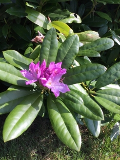
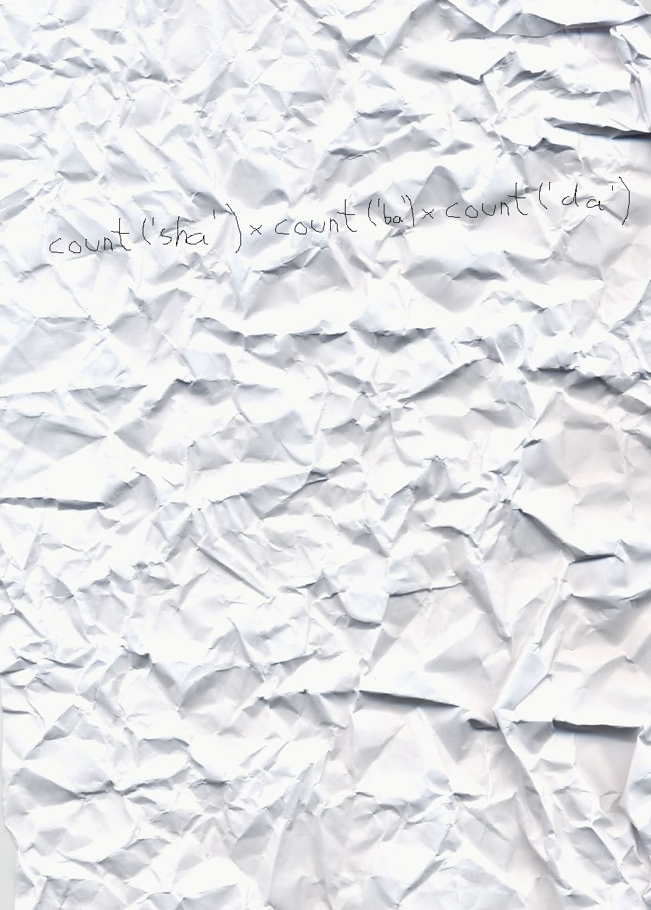
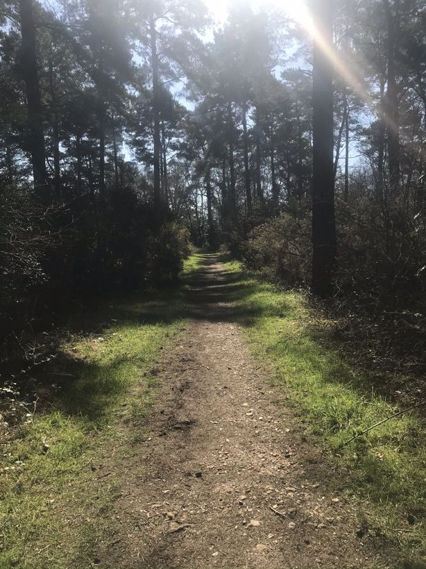

# Stegosaurus Challenge

EscapeTeam, welcome to the Stegosaurus challenge. An international thief known as Stegosaurus has left three clues to his next crime and we need your help. Instructions do not need to be printed. 
We recommend you download images (click the link below each image) for Phase 1 and 3 challenges in order to view and work with the files on your local machine.

## Notes
### Phase 1 - Flower

* There's something not quite right with this [picture](Phase1/flower.jpg). I just can't see it though... 
* We've analysed the photo thoroughly and cannot find anything out of the ordinary...
* We so hoped we would find a `CODE`

### Phase 2 - Gorillaz
Apparently he was heard singing the chorus from the current most listened to Gorillaz song. 
* Where can we `spot` the most listened to song by a group? 
* We can only think there must be some kind of code, like a a repeating pattern...
* Apparently he dropped a scrunched up [serviette](Phase2/paper.jpg)

### Phase 3 - Photo
 
* The following [photo](Phase3/original.jpg) is a well know piece by a famous photographer. 
* We've been left a [modified copy](Phase3/modified.jpg). 
* But I cannot understand what the differences are. Can you?
